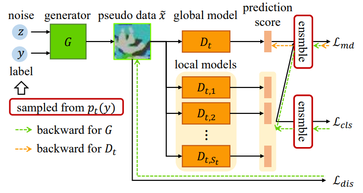

# Fine-Tuning Global Model via Data-Free Knowledge Distillation for Non-IID Federated Learning (FedFTG)

This is the official pytorch implementation of "[Fine-Tuning Global Model via Data-Free Knowledge Distillation for Non-IID Federated Learning](https://openaccess.thecvf.com/content/CVPR2022/html/Zhang_Fine-Tuning_Global_Model_via_Data-Free_Knowledge_Distillation_for_Non-IID_Federated_CVPR_2022_paper.html)" in the proceedings of the IEEE/CVF Conference on Computer Vision and Pattern Recognition (CVPR) 2023.

## Introduction

Federated Learning (FL) is an emerging distributed learning paradigm under privacy constraint. Data heterogeneity is one of the main challenges in FL, which results in slow convergence and degraded performance. Most existing approaches only tackle the heterogeneity challenge by restricting the local model update in client, ignoring the performance drop caused by direct global model aggregation. Instead, we propose a data-free knowledge distillation method to fine-tune the global model in the server (FedFTG), which relieves the issue of direct model aggregation. Concretely, FedFTG explores the input space of local models through a generator, and uses it to transfer the knowledge from local models to the global model. Besides, we propose a hard sample mining scheme to achieve effective knowledge distillation throughout the training. In addition, we develop customized label sampling and class-level ensemble to derive maximum utilization of knowledge, which implicitly mitigates the distribution discrepancy across clients. Extensive experiments show that our FedFTG significantly outperforms the state-of-the-art (SOTA) FL algorithms and can serve as a strong plugin for enhancing FedAvg, FedProx, FedDyn, and SCAFFOLD.



## Contents

This project includes the implementation of the FL method FedFTG, and the implementation of the combination between FedFTG and FedProx/FedDyn/SCAFFOLD/MOON. Currently it can only processes CIFAR10 and CIFAR100 datasets.

## Data Preparation

<p hidden>
The types of dataset segmentation in this project are IID and Non-IID.
### IID (identifically and independently distributed)
+ It merely uniformly split the dataset into N clients at random. The local dataset located in different clients have the same data distribution. 
### Non-IID (non-identifically and independently distributed)
+ The dataset is segmented with its natrual property. A popular way for realizing non-iid dataset segmentation is utilizing Dirichlet distribution, which is adopted in this project. It uses Dirichlet distribution on the label ratios to ensure uneven label distributions among clients for Non-IID splits. </p>

### Download dataset

Create `"results/Data/Raw"` directory under the root of this project.
```
mkdir -p results/Data/Raw
```
Download CIFAR10 and CIFAR100 datasets, and put them into `"results/Data/Raw"`.

### Segment dataset

The types of dataset segmentation in this project are IID (identifically and independently distributed) and Non-IID. A popular way for realizing Non-IID dataset segmentation is utilizing Dirichlet distribution, which is adopted in this project.

`prepare_data.py` provide an example to segment CIFAR10 dataset into 100 Non-IID sub-datasets with balanced data number.
```python
d = dataPrep("CIFAR10", root_dir =Path("results/Data/"))
d.make(mode=1, num_clients=100, dir_alpha=0.05, lognorm_std=0.0, show_plots=False, seed=1024)
```
Note that `mode=0` indicates IID segmentation, and `mode=1` indicates Non-IID segmentation. `num_clients` is the number of output sub-datasets. `dir_alpha` is the hyper-parameter of Dirichlet distribution for Non-IID dataset segmentation. `lognorm_std` indicates the balance of sub-datasets. `lognorm_std=0.0` means the data numbers of sub-datasets are equal, while `lognorm_std=0.3` represents utilizing lognormal distribution to generate unbalanced data with variance=0.3. 

## Run the script

Quick launch the experiment by running the script:
```
bash CIFAR10_FedDyn.sh
```

Change the parameters to run experiments for different datasets, data distributions, etc.

### Parameters Description

#### 1. Basic Parameters


>+ **seed**: seed for reproducibility, default is 1024
>+ **method**: traning method, choices in {'FedAvg', 'FedProx', 'FedDyn', 'SCAFFOLD', 'FedNova'}, default is 'FedDyn'
>+ **dataset**: training dataset, choices in {'CIFAR10', 'CIFAR100'}, default is 'CIFAR10'
>+ **exp_name**: experiment name, input whatever you want, default is 'Federated'
>+ **save**: bool value for saving the training results or not, default is False
>+ **savepath**: directory to save exp results, default is 'result/'
>+ **print_freq**: print info frequency(ACC) on each client locally, default is 2
>+ **save_period**: the frequency of saving the checkpoint, default is 200

#### 2. Data Segmentation Parameters

>+ **n_client**: the number of the clients, default is 100
>+ **rule**: split rule of dataset, choices in {iid, Dirichlet}
>+ **alpha**: control the non-iidness of dataset, the parameter of Dirichlet, default is 0.6. Please ignore this parameter if rule is 'iid'
>+ **sgm**: the unbalanced parameter by using lognorm distribution, sgm=0 indicates balanced

#### 3. Training Parameters

>+ **localE**: number of local epochs, default is 5
>+ **comm_amount**: number of communication rounds, default is 1000
>+ **active_frac**: the fraction of active clients per communication round, default is 1.0, indicating all the clients participating in the communications
>+ **bs**: batch size on each client, default is 50
>+ **n_minibatch**: the number of minibatch size in SCAFFOLD, default is 50
>+ **lr**: client learning rate, default is 0.1
>+ **momentum**: local (client) momentum factor, default is 0.0
>+ **weight_decay**: local (client) weight decay factor, default is 1e-3
>+ **lr_decay**: local (client) learning rate decay factor, default is 0.998
>+ **coef_alpha**:alpha coefficient in FedDyn, default is 1e-2
>+ **mu**: mu parameter in FedProx and MOON, default is 1e-4
>+ **tau**: mu parameter in MOON, default is 1
>+ **sch_step**: the learning rate scheduler step, default is 1
>+ **sch_gamma**: the learning rate scheduler gamma, default is 1.0

## Citation

If you find our work is useful for your work, please kindly cite our paper.

```
@inproceedings{zhang2022fine, 
  title={Fine-tuning global model via data-free knowledge distillation for non-iid federated learning},
  author={Zhang, Lin and Shen, Li and Ding, Liang and Tao, Dacheng and Duan, Ling-Yu},
  booktitle={Proceedings of the IEEE/CVF conference on computer vision and pattern recognition},
  pages={10174--10183},
  year={2022}
}
```
